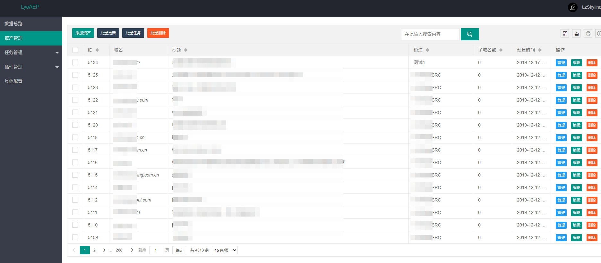

# 项目简介

本项目的开发初衷是想提供一个轻量级、简单易用的自动化渗透测试平台, 能够让企业安全负责人能够快速的对内部域名资产进行黑盒扫描

之前找了好久类似的开源项目，但都没有特别符合我的需求的，所以自己撸一个

目前是用的Flask + SQLite + Layui开发，所以不用装别的额外服务，pip install - requirement.txt 之后直接就能运行

目前是准备把项目分为五大模块：

- 数据总览

  仪表盘, 方便快速查看当前数据总览

- 资产管理

  说白了就是Target列表

  支持分组添加资产、支持添加子资产，可以方便快捷的对指定分类的数据进行批量扫描

- 任务管理

  控制扫描任务的启停等操作

- 插件管理

  放各种PoC，能不能有产出就靠这个了

- 系统配置

  针对LyoAEP平台做一些配置设置，如管理密码、最大线程数等

放个预览图：

目前还属于半成品，资产管理的功能大部分做完了，能够实现基本的增删改查，跟插件扫描任务有一些简单的联动

插件部分写了资产信息更新、部分命令执行漏洞的检测，后面会加上端口扫描和子域名扫描

任务管理只做了定时任务，在线任务控制的功能还没开始做

之后慢慢完善吧，先画个饼